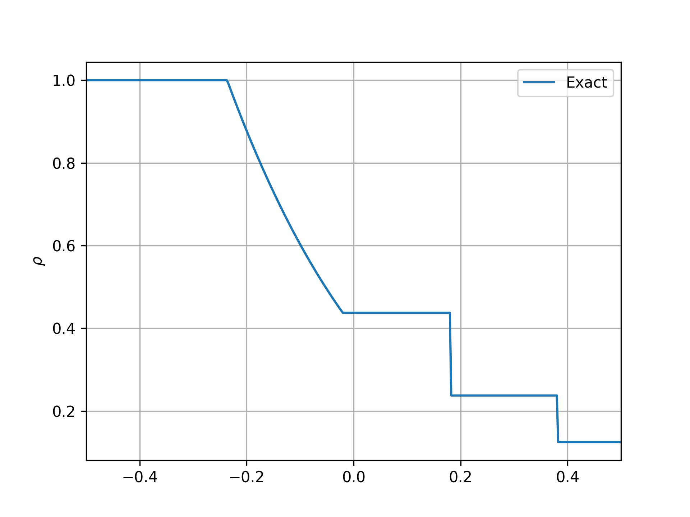
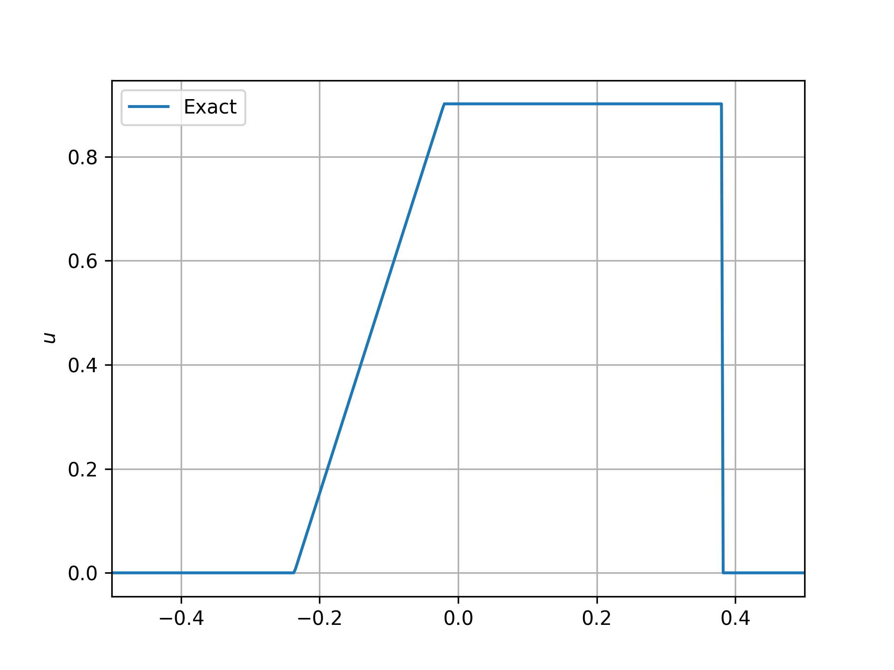
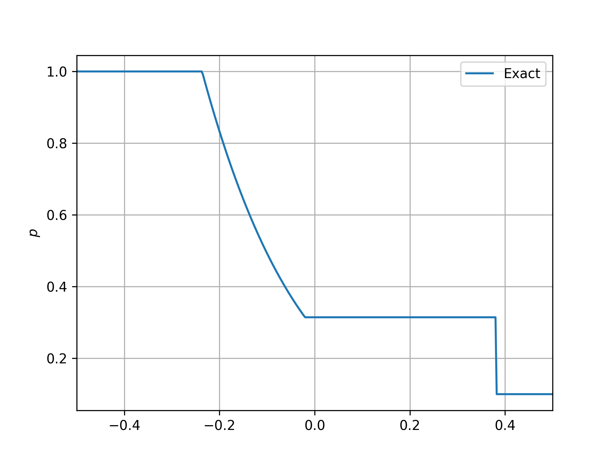

# 一维多介质黎曼问题求解器的精确解

控制方程是Euler方程组，气体状态方程是刚性气体状态方程
$$
p = (\gamma-1)\rho e - \gamma p_{\infty}
$$
求解的数值方法是牛顿方法。

数值方法的实现流程

Cutforth, M. C. (2019). *Sharp interface schemes for multi-material computational fluid dynamics*. https://doi.org/10.17863/CAM.44907

## 例子

初始值
$$
(\rho, u ,p, \gamma,p_\infty) =
\begin{cases} 
(1,0,1,1.4,0) \\
(0.125,0,0.1,1.667,0)
\end{cases}
$$
计算的终止时间是$t=0.2$.

## 完全解

| 密度                      | 速度                  | 压强                  |
| ------------------------- | --------------------- | --------------------- |
|  |  |  |

